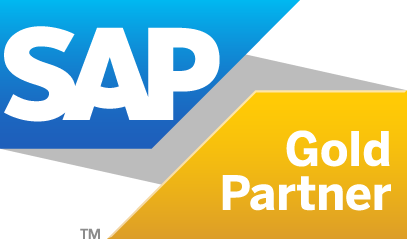

<!-- 
 -->

<picture>
  <source media="(prefers-color-scheme: dark)" srcset="cpro-dark.png">
  <source media="(prefers-color-scheme: light)" srcset="cpro-light.png">
  
</picture>

# Welcome

We are consultants and developers, focused on Industrial IoT and connectivity - racking up 20+ years of experience in process optimization together with our parent corporate network, the [Cpro Industry Projects & Solutions](http://www.cpro-ips.com).

We connect established IT landscapes such as ERP-systems to modern shopfloor IoT solutions and create value boosting your maintenance plan, failure detection, employee training and production process.

We integrate latest technologies with battle-tested infrastructure and accelerate digital transformations of customers ranging from middle sized companies to large cap corporates - beginning with simple connectivity solutions up to fully-fledged IoT-Platform solutions with Augmented Reality capabilities.

    <a style="display: block; height: 100px; width: 500px; background: #003064; color: rgba(225, 158, 25, 1); border: 1px solid rgba(225, 158, 25, 1); text-align: center; font-weight: bold; font-size: 300%; line-height: 100px; font-family: Arial; border-radius: 20px; text-decoration: none;" class="cta" href="https://www.cpro-iot.de/kontakt/">Contact us</a>

Check our [website](https://www.cpro-iot.com), visit us in one of our [six offices](https://www.cpro-iot.de/unternehmensprofil/#standorte) in Germany or drop us an [email](https://www.cpro-iot.de/kontakt/) to get in touch and learn more!

## Partners

We maintain strong partnerships with industry leaders.
 

  
     

  

<!--

    

    
    

    

-->

<!--
 ![PTC ThingWorx](https://img.shields.io/badge/ThingWorx-Gold?labelColor=686565&style=for-the-badge&logo=data:image/png;base64,iVBORw0KGgoAAAANSUhEUgAAACEAAAAOCAMAAACWwIW+AAAAAXNSR0IArs4c6QAAAARnQU1BAACxjwv8YQUAAAGbUExURWxtcXp7fsbHyNHR0oGChW5vc3Bxda+wsvb29/////r6+7q6vHR1eH9/g9jY2ZmZnOnq6vn5+fT09fDw8aOkpm1ucmtscH5/g9zc3Z2eoc/Q0ZeYmpaXmsDBwvz8/aqrrXJzd9jZ2rCxs+jo6bS1t5KSle7u7vr6+uvr63Z3e3d4fM7P0Ozs7bO0tqKjpZWVmLm5u/39/f7+/snJy6enqq6usXN0eMbGyHR1eczMzre4uoCBhNzd3qeoqtTV1qipq5ydn7Gzs3CVY2ypVHqOdsfIya6usHFydu3t7n+Ag+Dg4Wx8amyxUGy9SmyhV4uVit3d3ri6unN+dOfo6Ozt7YmKjdXW12yLYmywUGy8Smy6TG2WX3+SemyuUWyRX/v7+4KDh4uMj+Pj5J+gomyeWWyEZmyqU2ytUmyHZGyfWPPz8+Hh4o+Qk5qbnbu8vebm5np7f2x9aWy0Tmy4TGyQYGy1TmyAaOnp6amqrHx9gIWGiaChpJmanWxwb2yVXWy6S2y7S2yYXGxxb2x3bGyiV2ykVmx4a2yBZ2yDZnlmfc8AAAAJcEhZcwAADsMAAA7DAcdvqGQAAAExSURBVChTjZDXUgJBEEUbFLUNqOgiRhQQRDGsAUEMGBfUNueAOWcxYc762fawWz7gi+eh+96pU1NTA/9Dp09K1uIvBm0LUlLTENMzMrWqkmXUApOdg5hrQszLl0Q1g9nMq8AiZvykEBGLiktKyxCtXMsrbHa7w1DpdFW5q2ucnloJ6tBe3yA3NjXL2MKGV271uf1tEGiXwNgB3s4uCHb39Pb1y3wTDgjDpAD4QlLYAoFB7oobhoaJaGR0DF3jE8KY5AFTChvTMyICzBLNzdPCYnBpOcLVu7IKsLYObCihMEBwQxibW9s7u3tEcWP/wObwHAoDjjzH+pNTODsnikYuokSXV8K41llvYvxJt1xid/f8Knh4fOKX0PPLKxc2xEzk7Z3o41PNil/diXx9a+EPAD81EDX51IA3nQAAAABJRU5ErkJggg==&color=74c34d&logoWidth=50&) ![VuforiaStudio](https://img.shields.io/badge/Vuforia_Studio-Gold?labelColor=ffffff&style=for-the-badge&logo=data:image/png;base64,iVBORw0KGgoAAAANSUhEUgAAACMAAAAnCAYAAACFSPFPAAAAAXNSR0IArs4c6QAAAARnQU1BAACxjwv8YQUAAAAJcEhZcwAADsMAAA7DAcdvqGQAAAWTSURBVFhHrZhdbBRVFMdnZttCiVrQICQqhrQiTUw0IlGjNCn92pomJhps7AvWkJjYVqS1tUCNJW1DIVrQrhprYiSg4cEA0YZuP7btA0oQn+iDRK0JMSAxGKmoUOzO+Dt3Zja73a/ZZf/Jyd5zdvf2N/ece+7d6totqqqqaqlhGPWmaQ6Pj4//4YSzUtYwZWVlemFhYZ2u6+/iPoBdsSyrGxsaGxv7T30oQ2UFU1NT8yAQAwxrscVznAOodXR0NOT4npURTHV19R2kZDfD7dgSFUwsCzsGVAdQv9ih9PIEQ13AYDSwGv2499hRT/oXoAFsH6n724klVVoYUrIBiIMMn7YjWelXgDoXFhaOhkIh04nFKSkMKVkJRA+2DddnR29Zp4DaQeq+d/wYxcGQknxS8goQe3DvtKM5VRj7jFbQReou2yFbMTCkpByIAwwftiOeJMsexJ7EVkjAo66ySr1ABehP8xJQMKRkDauxn+EWzJCYR51lQtnGp3iQVfiS1kZe89S73nSeOdrC4fCIgvH7/ad5eULGHnWZCbqY4NDExMSCE1PiwR7lwWR1y+yIJ0krWO/CfMfLRhmn0U0gAlgP+b4qgZYpf76uGS+amhUKlI9clFhlZaXh8/m2sEr7cO+XmAeVZgIz4qTkvOMD8kyVrqlO/BB2DdtLDRwIVIzckPfZDMtYpXagOnCXSSyFPMH8KDkFYtjxBaIYiHcYPoupOaI0a2lW+7x288RQ+YQsv6pJWSWsHnfx512lhJkDoo8nfd+t9ubJ2tsNXe9kvlbcpRJLIUis1sHykzOOL7u1DCBZyQ12JEYJYcJAHMZ2UxeXJNAUqmG1fQ2sxl7ceyXmUXJ6DwHVDdQVCZC6PCZrBKoHV3agqziY00BIhzwjcREp2QiE7I6n7EhWAsTqNi1zKLA5qK4XpG4FQF1YE64cuhGY40AcZ6t+zlaVDglE7Wog+kjJVtxcHQczTuomHF9Stx4guRO1KZiKioo8DjDVL5qnaguAaMG6cJdLLMeSoj4hRQ7UrB2ybwYKxlXzlL/I0HxyKUpUYLnWdYDqAfra8WNbf6A8OMcHnmN4FEt61OdAP/N3GkzNjLQLkVsz+6mZIxTuORVFFO4mp3BzuUp/kaX+sGke/KAieF0CFPJt1Iw0xkPRu+kR7BOg3gZKbcOmyZo8Q/e9BFQvbvQ2zFRsCusLVmPnYOyR8QIQcnuUIyNhn5Fb/h6a3cc0O7UNWyZr2YaGFHQzViCxDHQGiB3UhhzGSs7tUZpf9GGasgPPACVnUWQbkjq+oLahH4sp/gT6DYhdYWvh8Iebx1S7ICV3A9GLJbpmpIQRqW3IKr1BN47c8oGqc6DW2ZEYydHxnqWZfaSEGlHbtoCu2wTEW7jJLmBpYVzdYJUGgOondXI6c075C6in1xhK+oowAR9mNdpIyU+MlUiJ30lJqR1JKs8wri4CtdPp1GrrU0+r+WOdkASBkOunEilZx2rIyV6HpUupKGMYV9869RQ5w1wBUQTcLkxWLd3JHq1SdeYUFxdf4MuPMVwpvgfdx+cbS0pK1vLds7Ozs9eA8OFvZTWO8Z4UuNd78D88mLSO4cjyUWRLmOhVJkpVZIkk955BvlfF+HE75ElSY19Sh+1sjgsSiMslT7gKKLlrvIzl6rReLGkbr5PmScdXSlpYTmOS42CTHcmJ/gSimw3wERsg7t8mKauclq3TsuuBklv+GjualaTpfUpK5Ffk73YoXilhXJE6Ocw6sDbcdLf8xZKdt52UJPx9HS1PMK6AWks9yS/P57F0370EhPSkI25PSqeMYFxRT/KbXLqqnPSLJcfBICnpJSVzdsibsoIRUU/51NM2oOS/FW5/CrIa0gx/cPyMlDWMK1J3F0BvMvxmfn7+q+npaekfWUjT/gcezlpmXOnu1gAAAABJRU5ErkJggg==&color=74c34d&logoWidth=25)   -->

<!--[Python](https://img.shields.io/badge/Python-316998?labelColor=ffd343&style=flat-square&logo=python)  -->

## Technologies

Our team operates in highly heterogeneous system landscapes and therefore built and continuously builds knowledge in a broad range of technologies.

| **Expertise** | **Techstack** |
| -| -|
| Databases |        |
| Frameworks |                            |
| Cloud Infrastructure |      |
| Development |           |
| Languages |                      | 
| Machine Learning |         |
| Operating Systems |       |
| Tools |                 |
| Servers |     |
| Test |      |
| Version Management |   
<!--

**Here are some ideas to get you started:**

🙋‍♀️ A short introduction - what is your organization all about?
🌈 Contribution guidelines - how can the community get involved?
👩‍💻 Useful resources - where can the community find your docs? Is there anything else the community should know?
🍿 Fun facts - what does your team eat for breakfast?
🧙 Remember, you can do mighty things with the power of [Markdown](https://docs.github.com/github/writing-on-github/getting-started-with-writing-and-formatting-on-github/basic-writing-and-formatting-syntax)
-->
